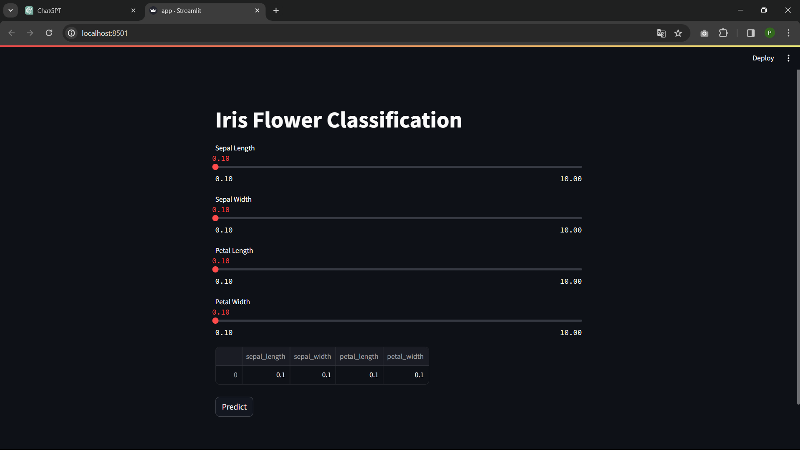
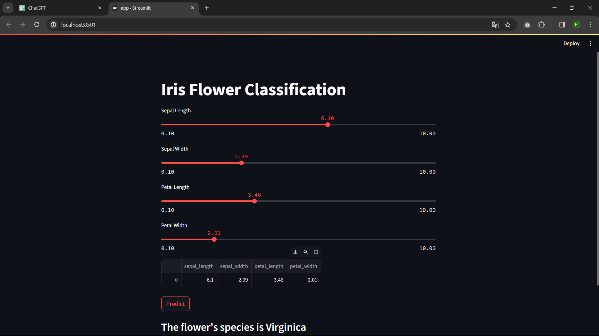

# Iris Flower Classification with Streamlit

This repository contains a simple web application built with Streamlit for predicting the species of an Iris flower based on its sepal length, sepal width, petal length, and petal width. The classification model used in this application is trained using the scikit-learn library and is stored as a pickle file.

## Getting Started

To run the application locally, follow these steps:

- 1. Clone the repository to your local machine:

- git clone

- pip install -r requirements.txt

- streamlit run app.py

# Usage

- Adjust the sliders for sepal length, sepal width, petal length, and petal width to input the characteristics of the Iris flower. Click the "Predict" button to see the predicted species of the flower.

# Model

- The machine learning model used for prediction is a scikit-learn logistic regression model. The trained model is stored in the 'lr.pkl' file, which is loaded by the Streamlit app.

- File Structure
- app.py: The main Streamlit application script.
- lr.pkl: The pickle file containing the trained logistic regression model.
- requirements.txt: List of dependencies needed to run the application.
- README.md: This file, providing information about the project.
- Acknowledgments
- This project uses the Iris dataset, a popular dataset for machine learning classification tasks.
- The logistic regression model is trained using scikit-learn, a machine learning library in Python.
- The web application is built with Streamlit, a framework for creating data applications with minimal code.
- Feel free to explore, modify, and contribute to this project!

- Remember to update the placeholder URLs and file names with your actual GitHub repository information. Also, make sure to include the 'requirements.txt' file if you have any additional dependencies beyond the ones mentioned in the example.

## Screenshot

